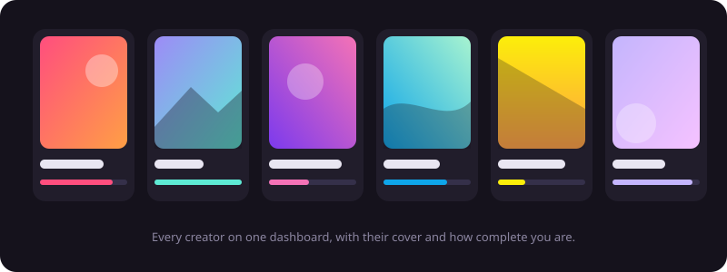
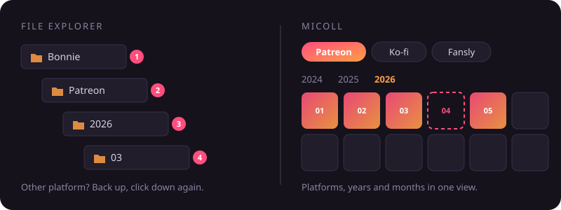
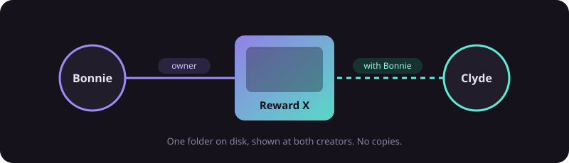
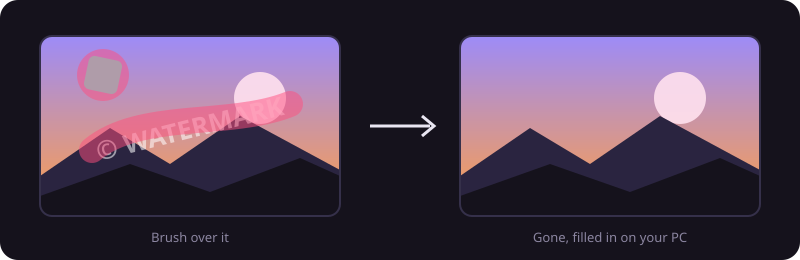
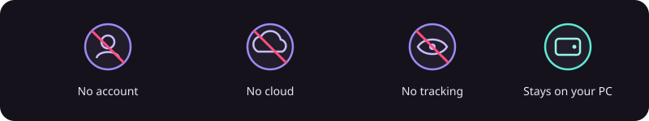
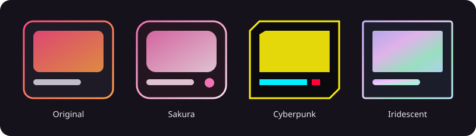

<div align="center">


# MiColl

**All your creator rewards in one place. Private, offline, yours.**

You back creators on Patreon, Ko-fi, Fansly and more. MiColl turns the pile of downloads
into one tidy library, without an account and without anything leaving your PC.

[**Download**](https://github.com/araxos/MiColl/releases/latest) · Windows 10 / 11

</div>

---

## All your creators, one dashboard

Every creator you support, with their cover art, platforms and how complete your
collection is. One look and you know where you stand.



## Every month at a glance

In the file explorer, every platform, year and month is another folder to click through.
MiColl shows it all in one view: pick a platform, see the years, see every month at once,
and what you own versus what's still missing.



## Collabs live in two places

A reward made by two creators shows up at both of them. The files stay in one folder,
so nothing is copied and you find it no matter whose page you open.



## Erase what you don't want

A watermark, a logo, a stray object? Brush over it and MiColl fills it in.
It runs on your PC with local AI, nothing gets uploaded.



## Your privacy comes first

No sign-up, no cloud, no tracking. Your library, thumbnails and database stay on your PC.
MiColl only goes online when you ask it to (updates, favicons, AI models, feedback).
You can even lock the whole library with a password and encrypt your files.



## Make it yours

Six colour accents for free, plus the **Aurora Pack** with three premium themes:
Sakura, Cyberpunk and Iridescent, each with its own animations, card frames and fonts.



## And also

- **Reads your folders as they are.** Nothing is moved unless you want a tidy structure.
- **Templates** list everything a creator released, so your completion % actually means something.
- **Viewer and editor** with slideshow, crop, resize, AI upscaler and background removal.
- **Duplicate finder** and a storage overview.
- **MiSD** moves rewards to an external disk and keeps showing them with previews.
- **Wishlist**, **SFW mode**, **9 languages** and **automatic updates**.

---

## For developers

Tauri 2 (Rust) + React 19, TypeScript, Vite, Tailwind 4, SQLite.

```bash
npm install
npm run tauri dev
```

Release build (signed for the updater): `npm run release`. Checks: `npx tsc --noEmit`,
`cd src-tauri && cargo test --lib`.

## License

© 2026 araxos. All rights reserved.

MiColl is free to use. The source code is published for transparency only, see
[LICENSE](LICENSE). Third-party components are listed in [THIRD-PARTY.md](THIRD-PARTY.md).
